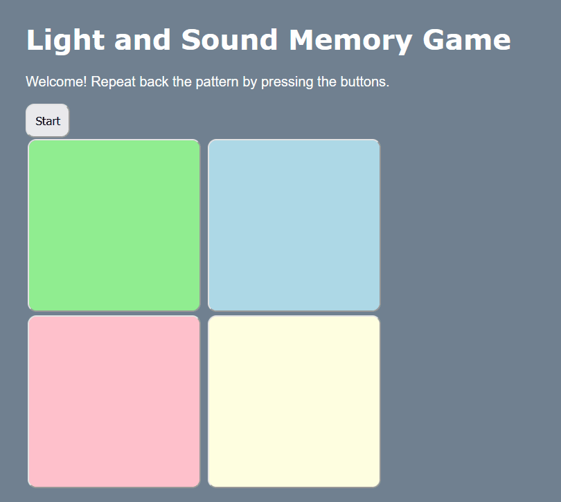

# Pre-work - *Memory Game*

**Memory Game** is a Light & Sound Memory game to apply for CodePath's SITE Program. 

Submitted by: Garrett Crowley

Time spent: 5 hours spent in total

Link to project: https://glitch.com/edit/#!/tourmaline-accurate-stomach

## Required Functionality

The following **required** functionality is complete:

* [X] Game interface has a heading (h1 tag), a line of body text (p tag), and four buttons that match the demo app
* [X] "Start" button toggles between "Start" and "Stop" when clicked. 
* [X] Game buttons each light up and play a sound when clicked. 
* [X] Computer plays back sequence of clues including sound and visual cue for each button
* [X] Play progresses to the next turn (the user gets the next step in the pattern) after a correct guess. 
* [X] User wins the game after guessing a complete pattern
* [X] User loses the game after an incorrect guess

The following **optional** features are implemented:

* [ ] Any HTML page elements (including game buttons) has been styled differently than in the tutorial
* [ ] Buttons use a pitch (frequency) other than the ones in the tutorial
* [ ] More than 4 functional game buttons
* [ ] Playback speeds up on each turn
* [ ] Computer picks a different pattern each time the game is played
* [ ] Player only loses after 3 mistakes (instead of on the first mistake)
* [ ] Game button appearance change goes beyond color (e.g. add an image)
* [ ] Game button sound is more complex than a single tone (e.g. an audio file, a chord, a sequence of multiple tones)
* [ ] User has a limited amount of time to enter their guess on each turn

The following **additional** features are implemented:

- [ ] List anything else that you can get done to improve the app!

## Video Walkthrough (GIF)

## Reflection Questions
1. If you used any outside resources to help complete your submission (websites, books, people, etc) list them here. 

Among all the resources provided in the walkthrough, I found https://www.the-art-of-web.com/javascript/creating-sounds/ incredibly helpful at explaining how sound output worked in JavaScript. I also used https://developer.mozilla.org/en-US/docs/Web/JavaScript to research JavaScript syntax.

2. What was a challenge you encountered in creating this submission (be specific)? How did you overcome it? (recommended 200 - 400 words) 

Before starting this project, I knew nothing about how sound could be played in web applications. I have worked with JavaScript/HTML/CSS in the past, but for whatever reason I have never considered using sound output. Initially, the playTone(), startTone(), stopTone() and initialization code looked unfamiliar to me, and I had very little understanding about what the code was actually doing. When I reached this roadblock, I reviewed the “JavaScript: Creating Sounds with AudioContext” article from The Art of Web that was provided in the walkthrough. I found that the article did a great job at breaking down many of the aspects of sound that were unfamiliar to me such as frequency, tone and time. Once I had a better understanding of the terminology and the syntax surrounding sound creation, the code made much more sense as I progressed through it line by line. Once I connected the functions to the buttons, I began to experiment with changing the values of the frequencies and time in order to get a better demonstration of how they worked. In doing so, I was able to create some interesting combinations and see what each of the JavaScript functions were doing as buttons were pressed and released. 

3. What questions about web development do you have after completing your submission? (recommended 100 - 300 words) 

After completing my submission, I am curious about how many modern websites are managed and maintained. Many of the websites I visit on a daily basis, such as Gmail and news sites, are able to update themselves with new information without the user ever having to refresh the page. These websites are never taken offline to be refreshed and instead manage to update themselves seamlessly. The web application that we built for this project and the other things that I have worked on in the past are static and visually look unimpressive when compared to many of my favorite websites that integrate dynamic elements into their UX/UI. I really wish to learn how to make these elements and implement them into my own webpages.

4. If you had a few more hours to work on this project, what would you spend them doing (for example: refactoring certain functions, adding additional features, etc). Be specific. (recommended 100 - 300 words) 

If I worked on this project for a few more hours, I would focus on implementing a random sequence generator for the pattern used in each game session, a decreasing time limit for each user input and a leaderboard. The random sequence generator would allow the game to have much more variability and ensure that the player does not simply learn the pattern. A time limit that decreased after every fifth element was added to the pattern would create intensity by keeping pressure on the player and making them anxious as they rapidly try to remember the pattern at an increasingly fast rate. The leaderboard would allow the player to feel a sense of accomplishment and give the player an incentive to keep playing in order to be number one.

## Interview Recording URL Link

[My 5-minute Interview Recording]  https://loom.com/share/4a082e89d63043148523d6bef3a011b1

## License

    Copyright Garrett Crowley

    Licensed under the Apache License, Version 2.0 (the "License");
    you may not use this file except in compliance with the License.
    You may obtain a copy of the License at

        http://www.apache.org/licenses/LICENSE-2.0

    Unless required by applicable law or agreed to in writing, software
    distributed under the License is distributed on an "AS IS" BASIS,
    WITHOUT WARRANTIES OR CONDITIONS OF ANY KIND, either express or implied.
    See the License for the specific language governing permissions and
    limitations under the License.
